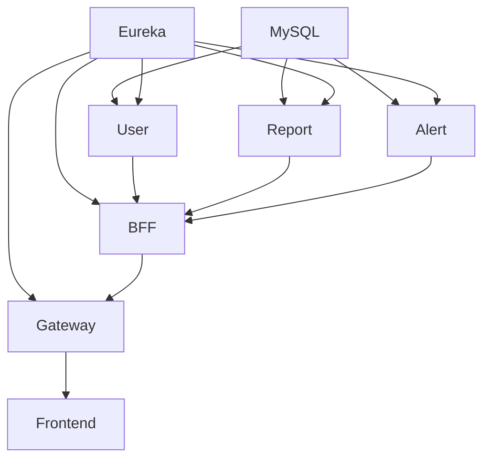

# Fullstack3 - Sistema de Emergencias Valle del Sol

Orquestación de microservicios para la gestión integrada de emergencias. Este repositorio contiene el `docker-compose.yml` que levanta los 8 servicios del sistema.

## Servicios

| Servicio | Puerto | Repositorio |
|---|---|---|
| Eureka Server | 8761 | `Fullstack3-Eureka-Server` |
| User Service | 8082 | `Fullstack3-User-Service` |
| Report Service | 8081 | `Fullstack3-Report-Service` |
| Alert Service | 8083 | `Fullstack3-Alert-Service` |
| BFF | 8084 | `Fullstack3-BFF` |
| API Gateway | 8080 | `Fullstack3-API-Gateway` |
| Frontend | 80 | `Fullstack3_CasoSemestralF_Frontend` |
| MySQL | 3306 | — |

## Requisitos

- Docker + Docker Compose v2
- Todos los repositorios clonados como hermanos de este directorio

## Levantar

```bash
docker compose up --build -d
```

## Orden de dependencias



## Patrones de Diseño Implementados

- **Strategy**: Cálculo de nivel de riesgo en Alert Service
- **Repository**: Acceso a datos (Spring Data JPA)
- **Circuit Breaker**: Resiliencia en llamadas entre servicios (Spring Cloud Circuit Breaker)
- **API Gateway**: Punto de entrada único con enrutamiento
- **BFF**: Backend For Frontend para abstraer lógica del frontend
- **Service Discovery**: Registro y descubrimiento con Eureka
